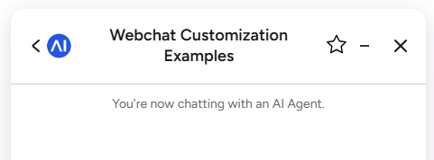
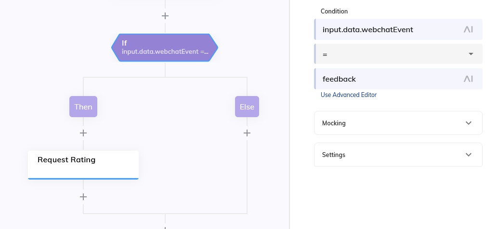

# Feedback Rating Button

A Cognigy Webchat customization that adds a feedback button to the webchat
header bar, which triggers the rating plugin so users can rate the
conversation.

## Overview

A button is injected into the webchat header bar. Clicking it sends a
data-only `feedback` event to the bot. The endpoint transformer/flow is expected to
catch this event in order to trigger a feedback rating. 

## Features

- **In-header control**: A feedback button is added to the webchat header bar.
- **Event-driven**: Sends a `{"webchatEvent": "feedback"}` input.data payload to the bot.

## In the flow

Because the feedback button drives a flow process, the reaction to the event is
handled in the **endpoint transformer** or the flow. The flow should look like this to catch the input.data value:

## Notes
This example only sends the `webchatEvent: "feedback"` signal; triggering the rating plugin and persisting/processing the result is expected to be implemented in your transformer/Flow.

**Client (`index.html`):**

| Constant | Description |
|----------|-------------|
| `ENDPOINT_URL` | Your Cognigy Webchat endpoint URL. |