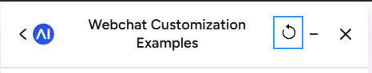

# Header Restart Button



A Cognigy Webchat customization that adds a restart button to the webchat header bar so users can restart the conversation with a single click.

## Overview

A circular "counterclockwise arrow" button is injected into the webchat header bar. Clicking it sends a fixed restart message to the bot, which your flow can use to reset the conversation.

## How It Works
Clicking the button will trigger two functions. 
1. It will end the current session and start a new one `window.cognigyWebchat.endSession();
`
2. It will inject a message into the flow to restart button, see below.

## Configuration

Change the restart message to match what your bot listens for:

```javascript
function restart() {
  window.cognigyWebchat.sendMessage("Neustart");
}
```
Handle that message in your flow however you want.