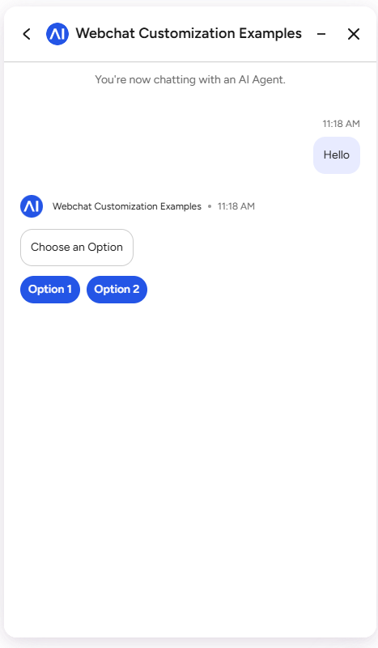
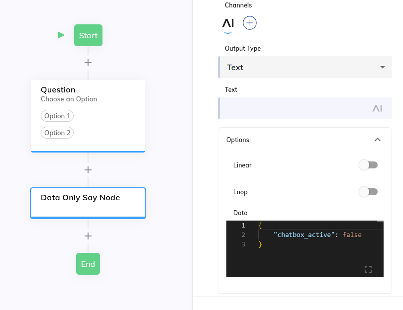

# Hide Text Input



A Cognigy Webchat customization that dynamically controls the visibility of the text input field based on incoming messages from the bot.

## Overview

This customization allows the bot to control whether users can type messages in the webchat. The text input field can be hidden or shown based on a `chatbox_active` flag sent in incoming messages. This is useful for creating interactive experiences where the chat input should be disabled at certain points in the conversation.


## How It Works

The customization hooks into the webchat's analytics service to monitor incoming messages. When a message is received:

1. The message data payload is checked for a `chatbox_active` flag
2. If `chatbox_active === false`: The text input field is hidden
3. If `chatbox_active === true`: The text input field is shown
4. The state is persisted in browser localStorage until it is changed
5. On page load, the previous state is automatically restored

## Configuration

### From the Bot

Send the following output data in your Say Node:

```json
{
  "chatbox_active": false
}
```


Set `chatbox_active` to:
- `true`: Show the text input
- `false`: Hide the text input

## State Management

### localStorage

The state persists across page reloads, so if a user hides the input and refreshes the page, it will remain hidden until the bot sends `chatbox_active: true`.

## Use Cases

1. **Form-Only Conversations**: Hide input while collecting structured form data
2. **Read-Only Sections**: Prevent input during informational messages
3. **Progressive Dialogs**: Show/hide input as the conversation progresses
4. **Conditional Interactions**: Enable/disable input based on user context

## Technical Details

### DOM Target

The customization targets this CSS selector:
```css
[data-cognigy-webchat-root] .webchat-input
```

This ensures it only affects the Cognigy Webchat input element.
