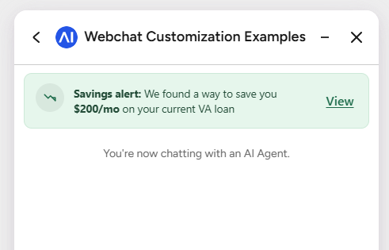

# Cognigy In-Chat Banner: Implementation & Usage Guide




A reusable, fully data-driven alert banner that renders **inside** the Cognigy  
Webchat window (directly under the header, above the conversation). The bot  
controls everything (copy, link, image, colors, and whether the user can  
dismiss it) by sending a single **data-only message**. The banner persists  
across minimize/restore and page reloads until the user closes the chat.

---

## Table of contents

1. How it works
2. Triggering the banner from a bot
3. Configuration reference
4. Persistence & lifecycle
5. Client examples
    - Airline: service outage / flight delay
    - Cellphone carrier: promotional deal
    - Bank: terms of service notice
6. Testing without a bot
7. FAQ / troubleshooting

---

## How it works

The solution hooks into the Cognigy Webchat **Analytics API**  
(`registerAnalyticsService`). It listens for the following:

| Signal | Behavior |
| --- | --- |
| An incoming **data-only message** with `invokeBanner: true` | Render the banner using the supplied `banner` config |
| An incoming data message with `invokeBanner: false` | Permanently remove the banner |
| Lifecycle event `webchat/open` | Re-show the banner if it was active before a minimize |
| Lifecycle event `webchat/close` | Clear the banner so it does not come back |
| Lifecycle event `webchat/minimize` | Keep state; the banner returns on the next open |

No changes to the bot's *visible* conversation are required. `invokeBanner` is  
carried in the message **data**, so nothing appears in the chat transcript.

The banner is injected next to the stable `#webchatChatHistory` element, so it  
survives Cognigy widget version bumps. It never relies on the hashed  
`cognigy-webchat-xxxxx` class names.

---

## Triggering the banner from a bot

In your Cognigy flow, add a **Say** node, switch it to **Data** mode (no text),  
and emit JSON shaped like this:

```json
{
  "invokeBanner": true,
  "banner": {
    "label": "Savings alert:",
    "message": "We found a way to save you {amount} on your current VA loan",
    "amount": "$200/mo",
    "actionLabel": "View",
    "actionText": "View savings"
  }
}
```

To remove it later (for example once the user resolves the issue):

```json
{ "invokeBanner": false }
```

When the user clicks the action:

- If `link` is set, the link opens (in a new tab by default).
- If `actionText` is set, a postback message is sent to the bot with  
`{ bannerAction: true }` in its data, so a flow can branch on the click.
- Both can be set at once.

---

## Configuration reference

Everything below lives under the `banner` object. **All fields are optional.**  
Anything omitted falls back to the default.

### Content

| Field | Type | Default | Notes |
| --- | --- | --- | --- |
| `label` | string | `"Savings alert:"` | Bold lead-in. Set to `""` to omit. |
| `message` | string | *(mortgage copy)* | Body text. Supports `**bold**` segments and the `{amount}` token. |
| `amount` | string | `"$200/mo"` | Substituted into `{amount}` and rendered **bold**. |

> **Bolding text:** wrap any words in `**double asterisks**`, for example  
> `"Flight **AA482** is delayed"`. The `{amount}` token is a convenience that  
> inserts `amount` already bolded.

### Action

| Field | Type | Default | Notes |
| --- | --- | --- | --- |
| `actionLabel` | string | `"View"` | The clickable link text. Set to `""` to hide the action entirely. |
| `actionText` | string | `"View savings"` | Postback sent to the bot on click. Set to `""` or omit to send nothing. |
| `link` | string (URL) | `null` | If set, the action opens this URL. |
| `linkTarget` | string | `"_blank"` | `_blank` (new tab) or `_self`. |

### Media

| Field | Type | Default | Notes |
| --- | --- | --- | --- |
| `imageUrl` | string (URL) | `null` | Optional image shown in the circular slot **instead of** the default icon. Square images look best (rendered about 36px, `object-fit: cover`). |

### Styling

| Field | Type | Default | Notes |
| --- | --- | --- | --- |
| `backgroundColor` | string | `#e6f6ec` | Banner fill. Any CSS color. |
| `borderColor` | string | `#cde9d8` | Banner border. |
| `textColor` | string | `#234c38` | Message/label color. |
| `accentColor` | string | `#1d6b4a` | Icon stroke + action link color. |

### Behavior

| Field | Type | Default | Notes |
| --- | --- | --- | --- |
| `dismissible` | boolean | `false` | Shows an **X** so the user can close the banner. The close button has a 44px touch target. |
| `dismissOnAction` | boolean | `false` | Auto-close the banner after the action is clicked. |

### Accessibility / touch

- The banner uses `role="status"` so screen readers announce it.
- Action and dismiss controls have **44 x 44px minimum tap targets** (Apple HIG  
and WCAG 2.5.5) and `touch-action: manipulation` to avoid the mobile  
double-tap zoom delay.

---

## Persistence & lifecycle

State is stored in `localStorage` under the key `cw-banner-state` as  
`{ showBanner: true, cfg: { ...the banner config... } }`.

| Event | What happens to the banner |
| --- | --- |
| `invokeBanner: true` received | Saved to storage **and** rendered |
| Window **minimized** | Removed from DOM by the widget, **but state is kept** |
| Window **reopened** (`webchat/open`) | Re-rendered from saved state with the same content |
| Window **closed** (`webchat/close`) | State cleared, will **not** reappear |
| `invokeBanner: false` received | State cleared, banner removed |
| User clicks **X** (`dismissible`) | State cleared, banner removed |
| Page reload | Re-rendered on open (localStorage survives reloads) |

> **Want it to reset on full page reload** but still survive minimize? In the  
> code, change the `STORAGE_KEY` storage from `localStorage` to  
> `sessionStorage`. A minimize/restore does not reload the page, so session  
> storage still covers it.

---

## Client examples

Copy any block below into a Cognigy **Say** node set to **Data** mode. Each is a  
complete, ready-to-send payload, with notes describing the screenshot to  
capture.

### Example 1: Airline service outage


> An airline alerting a traveler that their flight is delayed, with a  
> dismissible red "alert" treatment and a link to the live tracker.

```json
{
  "invokeBanner": true,
  "banner": {
    "label": "Service alert:",
    "message": "Flight **AA482** to Chicago is delayed by **2h 15m** due to weather.",
    "actionLabel": "Track flight",
    "actionText": "Track my flight",
    "link": "https://www.aa.com/track/AA482",
    "backgroundColor": "#fdecea",
    "borderColor": "#f5c6c0",
    "textColor": "#7a271a",
    "accentColor": "#b42318",
    "dismissible": true
  }
}
```

**Screenshot to capture:** a soft-red banner reading  
*"**Service alert:** Flight **AA482** to Chicago is delayed by **2h 15m** due to*  
*weather."* with a red **Track flight** link and an **X** to dismiss.

---

### Example 2: Carrier promotional deal


> A cellphone carrier promoting an upgrade. Uses a brand image, a vivid blue  
> treatment, and a link to the offer page. Not dismissible (always-on promo) but  
> auto-closes once the user taps through.

```json
{
  "invokeBanner": true,
  "banner": {
    "label": "Limited-time deal:",
    "message": "Upgrade to **5G Unlimited** and save **$25/mo** for 12 months.",
    "actionLabel": "See offer",
    "actionText": "Show me the 5G deal",
    "link": "https://www.example-mobile.com/5g-offer",
    "imageUrl": "https://www.example-mobile.com/img/promo-5g.png",
    "backgroundColor": "#eaf2ff",
    "borderColor": "#c3d9ff",
    "textColor": "#1e3a8a",
    "accentColor": "#1a56db",
    "dismissOnAction": true
  }
}
```

**Screenshot to capture:** a light-blue banner with a circular promo image on  
the left, *"**Limited-time deal:** Upgrade to **5G Unlimited** and save*  
***$25/mo** for 12 months."* and a blue **See offer** link.

---

### Example 3: Bank terms of service notice


> A bank notifying customers of updated terms. Neutral grey treatment, an  
> informational message with no "amount", a link to the document, and  
> dismissible so the customer can acknowledge and clear it.

```json
{
  "invokeBanner": true,
  "banner": {
    "label": "Notice:",
    "message": "We've updated our **Terms of Service**, effective **July 1, 2026**. Please review the changes.",
    "actionLabel": "Review terms",
    "actionText": "Open updated terms",
    "link": "https://www.examplebank.com/legal/terms",
    "linkTarget": "_blank",
    "backgroundColor": "#f4f4f5",
    "borderColor": "#d4d4d8",
    "textColor": "#27272a",
    "accentColor": "#1d4ed8",
    "dismissible": true
  }
}
```

**Screenshot to capture:** a neutral grey banner reading  
*"**Notice:** We've updated our **Terms of Service**, effective **July 1,***  
***2026**. Please review the changes."* with a blue **Review terms** link and a  
dismiss **X**.

---

### Quick reference: the mortgage default (matches the original screenshot)

```json
{
  "invokeBanner": true,
  "banner": {
    "label": "Savings alert:",
    "message": "We found a way to save you {amount} on your current VA loan",
    "amount": "$200/mo",
    "actionLabel": "View",
    "actionText": "View savings"
  }
}
```

---

## Testing without a bot

Open the hosted page, open the chat window, and run in the browser console:

```js
// default mortgage banner
ChatBanner.show();

// airline-style alert
ChatBanner.show({
  label: "Service alert:",
  message: "Flight **AA482** is delayed **2h 15m**",
  actionLabel: "Track flight",
  link: "https://aa.com",
  backgroundColor: "#fdecea",
  borderColor: "#f5c6c0",
  textColor: "#7a271a",
  accentColor: "#b42318",
  dismissible: true
});

// remove it
ChatBanner.remove();
```

These calls drive the exact same code path the bot uses, so they are the  
fastest way to produce the screenshots above.

---

## FAQ / troubleshooting

**The banner doesn't reappear after minimize then reopen.**  
Some widget builds emit `webchat/open` only on first mount. Log `event.type`  
through a minimize/restore cycle; if a different event fires, add that case to  
the analytics handler alongside `webchat/open`.

`invokeBanner` isn't being detected.  
The bot's data lands at `event.payload.data`. A few widget versions nest it one  
level deeper (`event.payload.data.data`) if you wrap your output in a `data`  
key. Run `console.log(event.payload)` once to confirm where `invokeBanner`  
sits, and adjust the lookup in the code if needed.

**The image is squished.**  
The media slot is a 36px circle with `object-fit: cover`. Use a square source  
image for best results.

**Colors look off or unreadable.**  
`backgroundColor`, `borderColor`, `textColor`, and `accentColor` are  
independent. Set `textColor` and `accentColor` to maintain contrast against your  
chosen `backgroundColor`.

**I want it gone for good after the user acts.**  
Set `"dismissOnAction": true`, or send `{ "invokeBanner": false }` from the flow  
after the action postback is received.
