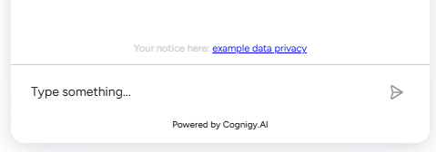

# Inject Text at Bottom of Chat



A Cognigy Webchat customization that injects a static text box — such as a privacy/data-protection notice — into the chat history.

## Overview

A custom `<div>` is inserted near the top of the chat history so a persistent notice (with an optional link) is always visible to the user. In the example it shows a German data-protection ("Datenschutz") notice, but the content is fully customizable.


## How It Works

1. A `MutationObserver` watches for the `.webchat-chat-history` element to render.
2. Once found, a `#custom-text-box` element is inserted (only if not already present).
3. It is placed at the bottom of the chat history via `insertBefore(..., chatHistory.childNodes[3])`.

## Configuration

Update `ENDPOINT_URL` to your Cognigy endpoint:

```javascript
const ENDPOINT_URL = "YOUR_COGNIGY_ENDPOINT_URL";
```

Edit the injected markup to change the message and link:

```javascript
customTextBox.innerHTML = `<div class="custom-text-box">
  <p>Your notice here: <a href="https://example.com/privacy" target="_blank">Privacy Policy</a></p>
</div>`;
```

Adjust the insertion point by changing the `childNodes` index in `insertBefore`.

## Troubleshooting

| Issue | Solution |
|-------|----------|
| Text not injected | Verify the webchat renders a `.webchat-chat-history` element |
| Box appears in the wrong spot | Tweak the `chatHistory.childNodes[...]` index |

## NOTE
Everything clear.