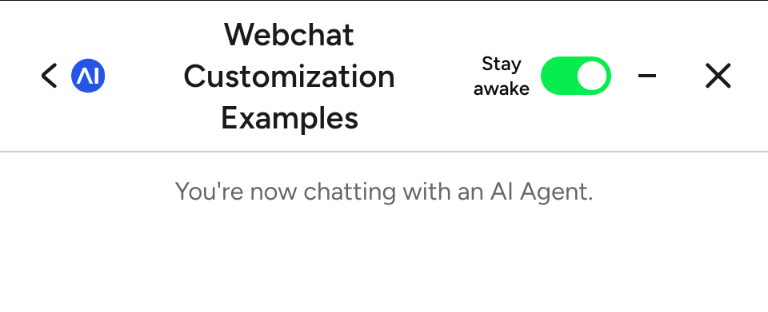

# Keep Phone Awake Toggle

A Cognigy Webchat customization that prevents the device screen from sleeping during conversations on touch-based devices (phones and tablets).

## Overview

This customization adds a "Stay awake" toggle button to the Cognigy Webchat header bar, allowing users to keep their phone screen active while chatting. This is particularly useful for longer conversations where users don't want the screen to go dark mid-interaction.

**Device Support:** Mobile phones and tablets only (detected via touch-primary device detection)

## Features

- **Toggle Control**: Users can enable/disable screen wake lock with a simple switch
- **Visual Feedback**: Green toggle indicator when wake lock is active
- **Smart Display**: Only appears on touch-enabled devices (phones/tablets)
- **Auto-Recovery**: Automatically re-acquires wake lock when the tab becomes visible again after being hidden

## How It Works

The customization uses the **[Screen Wake Lock API](https://developer.mozilla.org/en-US/docs/Web/API/Screen_Wake_Lock_API)** to request the device keep its screen active. When enabled:

1. A wake lock is requested from the browser
2. The screen remains on as long as the tab is active and the toggle is enabled
3. If the user switches tabs, the wake lock is automatically released
4. When returning to the tab, the wake lock is re-acquired

## Browser Support

The Screen Wake Lock API itself is supported on modern Chrome/Edge, Safari, and
most Chromium-based browsers on both mobile and desktop. This customization,
however, only shows the toggle on touch-primary devices, so in practice it
appears on:
- Chrome/Edge (Android)
- Samsung Internet (Android)
- Opera (Android)
- Safari (iOS/iPadOS)

**Note:** The toggle is deliberately hidden on desktop/non-touch devices (see
[Technical Details](#technical-details)), and any wake lock request will fail
gracefully on browsers without the API.

## Technical Details

### Implementation

- **Detection**: Uses `matchMedia` to detect touch-primary devices — the toggle
  is only injected when both `(pointer: coarse)` and `(hover: none)` match
- **API**: Leverages the [`navigator.wakeLock` API](https://developer.mozilla.org/en-US/docs/Web/API/Screen_Wake_Lock_API)

### CSS Styling

The toggle includes:
- Custom switch component with smooth transitions
- Green (#09ec4d) active state
- Minimal design to fit the webchat header

## Usage

`index.html` is a **complete, standalone Webchat host page** — not a script you
include into an existing page. It loads `webchat.js`, initializes the Webchat,
and adds the wake-lock toggle logic itself.

To use it:

1. Open `index.html` and replace the `initWebchat(...)` endpoint URL
   (currently a Cognigy trial endpoint) and `userId`/`settings` with your own.
2. Serve the file (or its contents) as the page that hosts your Webchat.

To add the toggle to an **existing** Webchat page instead, copy the wake-lock
`<style>` block and the `<script>` logic (the `requestWakeLock` /
`releaseWakeLock` / `toggleWakeLock` functions, the `visibilitychange` handler,
and the `MutationObserver` that injects the toggle) into your own page.

Once wired up, the toggle will:

1. Automatically inject into the webchat header bar once it appears
2. Be hidden on non-touch devices
3. Handle all wake lock requests and releases transparently

## Permissions

Users may receive a system prompt on Android devices when this feature is first activated, requesting permission to keep the device screen on. This is normal browser behavior.

## Browser Console

- **Success**: "Wake lock active" logged to console
- **Release**: "Wake lock released" logged to console
- **Errors**: Detailed error messages logged if requests fail

## Troubleshooting

| Issue | Solution |
|-------|----------|
| Toggle doesn't appear | Check if device is touch-primary (phone/tablet) |
| Wake lock doesn't activate | Browser doesn't support Screen Wake Lock API; check console for errors |
| Wake lock releases unexpectedly | This is normal when tab is hidden; it resumes when tab is active again |